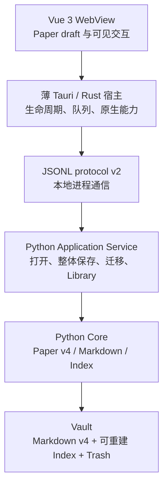

# Road v0.6：Paper v4 产品与架构设计

> 状态：设计、CP0–CP7 与 Road closeout 均已完成；最终 checkpoint 为 `18a1024`，
> 完整施工证据见只读 [Road v0.6 snapshot](../archive/snapshots/road-v0-6.html)。
>
> production 已使用 Paper v4、Index v4 与 protocol v2；不可达旧实现已删除，CP6 安全
> Gate 与 CP7 一号作者 Gate 已通过。未发生真实旧 schema 迁移，也不声称发布已完成。
>
> 当前权威边界与同步日期：本文的 Paper v4 grammar、Index v4、protocol v2、迁移和安全
> 合同于 2026-08-26 按 production source 复核；2026-08-30 再确认开发者 TUI、手册与根目录 `CONTEXT.md`
> 路由同步不改变这些合同。Road v0.6 的 UI、窗口几何与多行 Tags
> 呈现是历史记录，当前 presentation 由 [Road v0.7 设计](road-v0-7-app-shell-design.md)
> §17–§18 覆盖。

## 1. 核心判断

Road v0.6 是一次产品模型重构，不是 runtime 重写，也不是发布 Road。

旧流程是：

```text
灵感 → 编辑并保存 Paper → 另行打开只读 Flashcard
```

目标流程是：

```text
灵感 → 直接编辑由卡页组成的 Paper → 保存并带着 Paper 离开
```

一个 Paper 是一组有序卡页。卡页是权威作者内容，不再从 Summary 与 Highlights
二次渲染出另一套 Flashcard 数据。独立 Flashcard 页面、DTO、协议方法和渲染步骤
在调用方清零后退役；保存后的 Paper 仍在同一张卡页界面中浏览或继续编辑。

Road v0.6 保留本地优先、Markdown 权威、作者控制和现有桌面进程边界。它不增加
数据库、云同步、账号、遥测、AI 代写或隐藏后台服务。

## 2. Road 基线与完成边界

| 边界 | Road v0.5 基线 | Road v0.6 完成事实 |
| --- | --- | --- |
| 产品模型 | Paper v3：frozen initial Summary、current Summary、Highlights、Tags | Paper v4：`Paper.pages[]` 是权威内容 |
| 阅读体验 | 独立、只读、Summary-first Flashcard | 同一组卡页直接浏览，不再生成 Flashcard |
| 保存 | Summary/Highlights 表单整体保存 | 当前 Paper 的完整有序 `pages[]` 整体保存 |
| Markdown | schema v2/v3 分区格式 | schema v4 `keikeu:page` 注释块 |
| Bridge | JSONL protocol v1 | framing 不变，breaking contract 升至 protocol v2 |
| Library | Summary 预览与 Highlight 名称 | Paper 名称、第一页预览、页数、页标题与全页搜索 |

CP4 完成表中纵切换，CP5 删除不可达旧链，CP6 完成故障与修复 Gate，CP7 完成一号
真实作者接受；[SPEC](../SPEC.md)、[RULES](../RULES.md)、`src/` 与 `tests/` 共同描述
Paper v4/protocol v2。各层证据仍不得互相冒充。

## 3. 范围与明确排除

### 3.1 本 Road 包含

- Paper v4 领域模型与严格 Markdown codec；
- v2/v3 Paper 到 v4 的一次性显式迁移；
- Index v4、Library 投影与全页本地搜索；
- Paper 整体保存、CAS、dirty baseline 与错误恢复；
- JSONL protocol v2、Python DTO/service 与 Rust request policy 校准；
- Vue 3 大卡页工作台、基础/进一步模式、光标分页和删页；
- 独立 Flashcard 调用链退役；
- Paper v4 中文人工修复 HTML 手册；
- macOS Apple Silicon 工程 smoke 与一号真实作者 Gate。

### 3.2 本 Road 不包含

- Developer ID、签名、公证、staple、DMG 或可分发候选；这些延后至 Road v0.8；
- 二号用户测试、多用户 MVP 或移动端需求推断；这些最早在同时具备 iOS 与
  Android 客户端的 v1.0 重新设计；
- iOS、iPadOS、Android、HarmonyOS 或 Windows 客户端实现；
- Intel Mac、Linux 或 watchOS 支持；
- 自动保存、持久 `page_id`、单页 deep-link、页面重排或单页 Library 资产；
- 内置 Markdown 源码编辑器、富文本编辑器、Router、Pinia、TypeScript 或 UI kit；
- 新依赖、数据库、文件 watcher、账号、云同步、遥测、远端 Agent 或自动 push；
- AI 生成、代写、社区、交易市场或 Notion 式通用工作台。

远端 Git 仍由开发者人工 push；本 Road 不设计远端发布纪律。

## 4. 领域模型

目标模型保持最少字段：

```text
Paper
├── code: str
├── display_name: str | null
├── tags: list[str]
├── created: datetime
├── updated: datetime
├── legacy_title: str | null
├── extra_frontmatter: dict[str, str]
└── pages: list[CardPage]

CardPage
├── name: str | null
├── content: str
└── type: null | "summary" | "snapshot" | "whisper"
```

`display_name` 是整份 Paper 的稳定名称，继续用于 Library 和工作台外层标题。
`CardPage.name` 是页标题；删除或替换第一页不会改变 Paper 名称。两者不得合并成
一个隐式回退字段。

### 4.1 数据不变量

1. `pages` 是唯一持久顺序，且始终至少有一页。
2. 页面不保存 ID。Vue 可为组件渲染生成临时 `ui_key`，但不得发送或写盘。
3. 每页保存谓词精确为 `name is not None or content.strip() != ""`；这里的
   `str.strip()` 只判断是否含非空白字符，绝不修改持久 `content`。空串、纯空格、
   tab 或纯换行正文都算空；有非空标题的空正文页合法。草稿可暂时全空，Python Core
   是最终校验权威，Vue 不得用另一套字符规则提前拒绝合法内容。
4. `display_name` 与 `name` 可空；非空时只修剪外围空白，最多 200 个 Unicode code
   point，且不得含 `Cc`、`Cs`、`Zl` 或 `Zp` 类控制、代理或分行字符。空字符串修剪后
   成为 `null`；不执行 NFC/NFKC 规范化。
5. `content` 保存作者输入的 Markdown 文本，不总结、不规范化、不自动修复。
6. 一份 Paper 最多一个 `type="summary"`。已有 Summary 时，其他页类型下拉框中的
   “总结”选项保持可见但禁用，并显示“已有一页标为总结”；不得先允许选择再回退，
   也不得静默清除或改写已有页面。
7. `snapshot` 与 `whisper` 数量不限。
8. `type=null` 是有效值，在界面中不显示标签。
9. 持久类型与显示名的映射固定为：

| 持久值 | 显示名 |
| --- | --- |
| `summary` | 总结 |
| `snapshot` | 高光 |
| `whisper` | 碎碎念 |
| `null` | 不显示 |

“基础模式 / 进一步模式”只是 Vue 的显示状态，不属于 Paper schema。切换模式不得
修改 `name`、`content` 或 `type`；隐藏进一步模式也不得清空既有类型。

## 5. Paper 工作台交互

### 5.1 卡页结构

默认工作区是一张居中的大卡页：

- 卡页外层顶部保留一条 Paper 元数据栏：只读代号、始终可编辑的 Paper 名称
  `display_name` 与 Tags；它们在基础/进一步模式中位置不变；
- 顶部是始终可编辑的页标题 `name`；
- 中央是正文 `content`；
- 已标记页面显示“总结 / 高光 / 碎碎念”，未标记页面不显示标签；
- 卡页底端只有三个主操作：保存、删除本页、加一页；
- 页面序号导航位于卡页外层顶部，不挤入底部主操作；
- 进一步模式以可展开区域显示类型控件，不创建第二套标题或正文；
- Road v0.6 不提供页面拖拽或重排。

新建 Paper 默认包含一张空白页。页序号只导航当前内存快照，不写入路径或 URL。
页序号必须是键盘可达的真实按钮；触摸滑动或动画可以后加，但不得成为完成导航的
唯一方式。

Paper 名称空白时持久化为 `null`，Library 只在显示时回退到 `code`。为避免把合法 tag
中的逗号误拆，Tags 改为一个原生多行输入框，每行一个 tag；逗号只是普通字符。逐行
修剪外围空白，丢弃空行，并把修剪后完全相同的重复值折叠为第一次出现，余下顺序保持。
元数据栏不增加第四个底部按钮；其修改与页字段一起由同一个“保存”提交。

键盘契约只依赖原生控件：`Tab` / `Shift+Tab` 依次到达元数据栏、页序号、页标题、
正文、进一步模式与三个底部按钮；`Enter` / `Space` 激活按钮，类型下拉使用系统方向键，
`Cmd+S` 保存。v0.6 不增加会与正文编辑冲突的自定义左右翻页快捷键。加页后焦点进入
新页标题；删页后焦点进入留下的当前页标题；确认对话框遵守原生焦点与 `Escape` 行为。

名称长度由 Python Core 按 Unicode code point 作权威校验；Vue 不得用原生
`maxlength=200` 或 JavaScript `.length` 阻止输入。前端若提供即时计数，必须用
`[...value].length`，并仍显示 Python 返回的结构化校验错误。

### 5.2 加一页

“加一页”只修改 Vue 的 `draft.pages[]`，不调用磁盘 mutation：

1. 使用正文编辑器最后一个有效的 `selectionStart` 作为截断点；从未获得光标时按
   正文末尾处理。
2. 当前页保留截断点之前的正文。
3. 选中文本及截断点之后的全部正文原样移动到紧邻其后的新页，零字符丢失。
4. 当前页保留原 `name` 与 `type`。
5. 新页的 `name=null`、`type=null`，并成为当前页；焦点进入新页标题输入栏。
6. 在首尾截断可以产生临时空白页，但保存时仍受“标题或正文至少一项非空”约束。

由于 Python 只接收截断后的完整 `pages[]`，无需跨 JavaScript/Python 传递 UTF-16
光标偏移，也不增加 `page.split` 协议方法。

### 5.3 删除本页

- 删除前必须确认；确认只删除当前草稿中的页面。
- 多页 Paper 删除后选择原位置的下一页；若原页为末页，则选择新的末页。
- 删除唯一页面时，旧页面被一张全新的空白页替代，以维持“至少一页”不变量。
- 若替代页仍然全空，保存必须指出该页无有效标题或正文；不得为满足校验而静默
  删除这张页。
- 页删除只有在后续保存成功后才持久化。
- 整份 Paper 的删除仍是独立软删除/Trash 能力，不借用“删除本页”。

### 5.4 保存与离开

- Save 是唯一持久化边界；标题、正文、类型、加页和删页在保存前均为本地草稿。
- `Cmd+S` 与底部“保存”调用同一动作。
- dirty 比较覆盖 Paper 名称、Tags、所有页字段、页数与顺序。
- 只有整体保存成功才建立新 baseline；已知失败保留旧 baseline 与完整 draft。
- Paper/Vault 切换、Library 导航和窗口关闭继续共用离开保护。
- 不自动保存、不逐页保存，也不在导航时隐式保存。

## 6. Runtime 与组件边界

runtime 是应用启动后实际运行的进程、执行环境、通信、权限、生命周期和失败链，
不只是“使用了 Vue 与 Python”这份技术栈清单。



### 6.1 Vue 3

- `PaperView` 继续负责页面入口、打开/离开和 runtime 交互；
- 一个卡页编辑组件负责当前页的标题、正文和三个底部操作；
- 正常编辑时，draft、baseline、active index 与临时 `ui_key` 留在当前工作台；
- 任一 durable mutation 发出前，`App.vue` 根状态先保存唯一 pending intent：family、
  method、Python 已验证的参数摘要与可空 `vault_locator`（只在首次初始化前可空）。除
  `paper.save` 外不得复制作者正文；
  `paper.save` 另含完整 Save DTO、最近 baseline 作者投影与 `target_path`。发生
  `commit_unknown` 时即使发起组件因 sidecar 重启卸载，根状态也保留 intent；
- 不新增 Router、全局 Store 或单用途 abstraction；
- Vue 不读取 Markdown、不写 Index、不猜测 Vault 路径。

### 6.2 Tauri / Rust

- 继续只拥有 sidecar 生命周期、单队列 JSONL、请求匹配和原生 picker/confirmation/open/reveal；
- 因 breaking DTO 与方法集变化，握手常量从 protocol v1 升至 v2；
- 同步更新只读/mutation allowlist，删除旧只读卡片协议入口后不得残留兼容分支；
- Rust 不理解 CardPage、不拆页、不校验类型，也不写作者文件。

### 6.3 Python

- Application Service 是唯一产品编排层和文件 mutation 入口；
- `keikeu_core` 拥有 `PaperV4`、`CardPageV4`、严格校验和纯转换；
- `markdown_io.py` 继续独占 Paper Markdown parse/render；
- `indexer.py` 只生成可重建投影；
- v2/v3→v4 使用新的独立迁移模块；既有 `migration_v01.py` 保持冻结。

### 6.4 不做的 runtime 方案

- 不把 CPython 嵌入 Rust：会引入 ABI、GIL、打包和崩溃耦合；
- 不改为 localhost HTTP/pywebview：会增加端口、认证、生命周期和攻击面；
- 不让 Vue 直接访问文件：会复制 Python 已有的路径和作者资产规则。

## 7. 整体保存数据流

```text
Vue draft.pages[] + edit_token
  → protocol v2 PaperSave DTO
  → Service 验证当前 Paper 的完整快照
  → Core 校验所有不变量
  → CAS 检查磁盘源字节未被外部改变
  → 完整 render v4 并重新 parse 验证
  → 同目录临时文件 + 安全替换
  → 更新 Index v4
  → 返回新 Paper DTO 与 edit_token
  → Vue 建立新 baseline
```

整个事务边界是一份当前 Paper，不是整个 Vault。协议不增加 `page.add`、
`page.delete`、`page.split` 或逐页保存方法。

`paper.save` 成功结果固定为 `PaperSaveResultDto { paper, warnings }`；`warnings` 只能是
空数组或包含一次 `index_degraded`，不得根据成功路径返回两种不相干的 shape。若
Markdown 已安全替换但 Index 更新失败，Service 仍在 `paper` 返回权威保存结果，并在
`warnings` 返回 `index_degraded`。Vue 必须以 `paper` 建立新 baseline，提示列表/搜索
可能过期，并只提供显式重建 Index；不得把作者再次保存当成修复索引的方法。重建成功
且 Python 对 Index v4 完整校验通过后清除警告；仅收到一次无错误响应但未校验不得清除。

## 8. Markdown schema v4

### 8.1 正式形状

```md
---
type: paper
schema_version: 4
code: K-20260802-001
created: 2026-08-02T10:00:00
updated: 2026-08-02T10:30:00
display_name: 夜车上的约定
---
# K-20260802-001

<!-- keikeu:page {"name":null,"type":"summary"} -->
月光穿过夜行列车的车窗……
<!-- /keikeu:page -->

<!-- keikeu:page {"name":"橘子","type":"snapshot"} -->
对座递来半只橘子。
<!-- /keikeu:page -->

## Tags

- 夜车
- 重逢
```

### 8.2 语法规则

#### 文件与外层结构

1. 文件是无 BOM 的 UTF-8。parser 接受整份文件一致使用的 LF 或 CRLF，拒绝混合换行
   与裸 CR；
   内存中的 `content` 统一以 `\n` 表示逻辑换行，renderer 固定输出 LF 和一个文件末尾
   换行。换行编码转换只发生在用户明确保存时，不改变逻辑正文。
2. frontmatter 从第一行 `---` 开始并由下一条独占整行的 `---` 结束。`type`、
   `schema_version`、`code`、`created`、`updated` 必须各出现一次；`display_name` 与
   `legacy_title` 最多一次；任一重复 key、无冒号行或不合法值都失败。
3. 未知 frontmatter 只承诺保留解码后的 key/value 与首次出现顺序，再随 renderer 的
   scalar escape 重新输出；不承诺保留原空格、注释、转义拼写或字节布局。未知 key
   若与 v4 保留 key 冲突则失败，不覆盖权威字段。

   frontmatter scalar codec 固定沿用现有算法，不交给通用 YAML 猜测：每个非 fence 行
   必须含冒号，并只在第一个冒号处分成 key/value；两侧分别修剪外围空白。key 修剪后
   必须非空，不得含冒号、`Cc`、`Cs`、`Zl` 或 `Zp`，空 value 合法。value 从左到右
   解码 `\\`→反斜线、`\n`→LF、`\r`→CR；未知 `\x` 原样保留反斜线与 `x`，末尾单个
   反斜线也原样保留。renderer 反向转义反斜线、LF、CR，其余字符（包括 value 中后续
   冒号）原样输出。重复 key 一律失败。
4. frontmatter 后必须依次是与 frontmatter 完全相同的 `# <code>`、恰好一个空行、
   至少一个 page block、恰好一个空行、唯一的 `## Tags` 区。相邻 page block 之间也
   恰好一个空行；额外空行、空格行、HTML comment 或任何游离文本都严格失败。renderer
   输出同一 canonical 形状。

#### Page block 与可逆转义

5. start marker 必须独占一行，形状精确为
   `<!-- keikeu:page {JSON object} -->`；固定前后缀各只有图示中的一个空格。
   JSON object 必须恰有一次 `name` 和一次 `type`，两项都不得缺省，也不得有未知项或
   重复 key。parser 不把两项的键顺序当成语义；renderer 固定按 `name`、`type` 顺序
   输出 compact JSON，并使用 UTF-8 字符而非把中文转成 `\u`。
6. `name` 只能是符合 §4.1 校验的 JSON string 或 `null`；`type` 只能是
   `summary`、`snapshot`、`whisper` 或 `null`。为保证 HTML comment 合法，renderer
   把 `name` 中每个 U+002D HYPHEN-MINUS 编码为 JSON `\u002d`；parser 解码后恢复原名，
   并拒绝 payload 内任何原样出现的 `--`。这不是新增作者字符禁令。
7. start marker 后的第一条换行与 end marker `<!-- /keikeu:page -->` 前的最后一条
   换行是结构分隔。两 marker 相邻表示空正文；其间其余字符全部属于 `content`，包括
   Markdown 标题、列表、代码与正文首尾空行。block 顺序就是页顺序。
8. 两类正文保留行是：以 `<!-- keikeu:page ` 开头且以 ` -->` 结尾的整行，以及精确
   end marker。renderer 遇到“零个或多个反斜线 + 保留行”时再前置一个 `\`；parser
   仅在 page content 内按同一条件移除恰好一个 `\`。因此作者写下的 marker 与其前置
   任意数量反斜线均可无损 round-trip；未转义保留行只作为结构，位置错误时严格失败。

```text
作者正文                         文件中的 page content
<!-- /keikeu:page -->           \<!-- /keikeu:page -->
\<!-- /keikeu:page -->          \\<!-- /keikeu:page -->
```

#### Tags 与失败边界

9. `## Tags` 必须存在且是最后一个结构。空列表写成标题后直接到文件末尾；非空列表在
   标题后空一行，每项严格写成 `- {tag}`。tag 修剪后必须非空、单行且无控制字符；
   U+002C 逗号是合法普通字符；修剪后重复的值沿用现有语义只保留第一次，顺序保留。
   除可选的文件末尾换行外，不允许空 bullet、续行、其他列表标记、重复 Tags 标题或
   Tags 后文本。
10. 至少一个 page block、每页“标题或正文至少一项非空”及最多一个 Summary 的领域
    不变量在 parse 与 save 两端都执行。未知 page metadata、缺 marker、嵌套/错序、
    非法 JSON、无效 UTF-8、非法类型或任何外层游离文本必须严格失败。
11. parser 失败时不得生成部分 Paper，也不得写回“修正后”文件。错误必须给出结构
    类别与能可靠确定时的页序号，不以失败的半成品继续运行。

HTML 注释使结构在普通 Markdown 阅读器中不可见，同时让正文继续保持可阅读和可
手工修复。YAML/JSON 页面数组与 `## 页面` 分隔方案均不采用：前者损害可读性，
后者会与作者正文标题冲突。

## 9. v2/v3 → v4 迁移

迁移是显式的一次性操作，不在打开或保存时静默发生。正常 v4 runtime 不长期
双读旧 schema；legacy parser 只留在迁移模块中。

### 9.1 字段映射

| 来源 | v4 结果 |
| --- | --- |
| `code`、`display_name`、Tags、created、updated、路径、文件夹、Trash 位置 | 原样保留 |
| `legacy_title` 与未知 frontmatter | 可行时原样保留 |
| current Summary | 第一页：`name=null`、`type=summary`、正文为 Summary |
| 每条 Highlight | 依原顺序成为后续页；名称与正文保留，`type=snapshot` |
| v2 无名称 Highlight | `name=null` 的 Snapshot 页 |
| `initial_summary` | 按开发者已确认的产品决定丢弃，不进入 v4 active schema |
| Whisper | 不从旧数据推断；迁移不自动生成 |

丢弃 `initial_summary` 是一次明确、可审计的 schema 决策，不得扩展成运行时静默删文。
CP0 必须更新 [SPEC](../SPEC.md) 与 [RULES](../RULES.md) 中相反的 v0.5 约束；在该
权威冲突解决前，不得运行真实迁移。

合法 v2/v3 Paper 的 current Summary 本来就必须非空。若 legacy 文件的 Summary
为空、只有空白或无法由冻结 parser 合法读取，它不是可猜测的迁移特例：全量预检阻塞，
用户先按旧格式人工修复并重新预检；迁移不得擅自省略该页或从 Highlight 推断 Summary。

### 9.2 Legacy 原始字节丢失审计

迁移不得把“冻结 parser 能返回一个 Paper”误当成“所有作者字节都已映射”。v2/v3
preflight 必须在模型转换前，对同一份 source bytes 运行独立、只读、严格的 legacy
loss-audit：逐段标记 frontmatter、`# code`、每个已知 section、Summary、Highlight
名称/正文、Tags 与结构换行；每个 source byte 必须恰好属于一个已知结构或一个明确的
字段值。

以下任一情况都使该文件与整次迁移 `ready=false`、零写入，不能交给宽松 parser 忽略：

- 无冒号/空 key frontmatter、重复 key 或无法按冻结 scalar 规则解释的行；
- 重复已知 section、首个已知 section 前的游离正文、section 覆盖或 Tags 后游离文本；
- 不完整/错序 Highlight descriptor、编号跳变、未归属行或其他 ambiguous bytes；
- 任何既没有进入 v4 字段、也不是已批准丢弃项的非结构字节。

唯一允许“已消费但不进入 v4 active schema”的作者字段是开发者明确批准的
`initial_summary`；preflight/report 只记录每文件存在该处置，不记录正文或长度。
未知 frontmatter 必须进入 `extra_frontmatter`，不能算结构噪声。loss-audit 与 frozen parser
都通过后，才比较 mapping 后的字段等价性；两者任一失败都保持源 bytes 不变。

v2/v3 Tag 若含 LF、CR、其他控制/分行字符，或其续行会形成多行 tag，不能进入 v4 的
“一行一个 tag”契约；preflight 必须给出相对路径与 Tag 序号并阻塞，用户人工决定拆分或
改写后再预检，迁移不得自动拆分、拼接或删除。

为维持“唯一获准丢弃字段是 `initial_summary`”，legacy Tag 若为空项、带外围空白，
或 trim 后与另一项重复，也必须在迁移 preflight 阻塞并指向对应 Tag 序号。用户按旧格式
人工修复后再预检；迁移不得借 v4 正常编辑时的 trim、丢空和首次去重语义静默改变旧
字段。含逗号且不触发上述条件的单行 Tag 仍原样映射。

### 9.3 执行与中断

“原地改写”表示保持当前选中的 Vault 与 Paper 路径，不表示取消数据安全措施：

1. 先在 fixtures、合成 Vault 和完整副本上开发与验证。
2. 真实 Vault 迁移前显式说明影响，并按现行 RULES 在 Home 下、active Vault 之外创建
   一个可恢复的完整备份；替换任何源文件前完成 regular-file manifest 与逐字节验证。
   该备份不是受支持的双版本 runtime。
3. 扫描活动区、所有文件夹与 Trash 中的全部 Paper，而不是只相信 root Index 版本。
4. 全量预检旧文件，先做 §9.2 raw loss-audit，再在隔离 staging 中
   render→parse→字段等价验证；任一已知错误在写入前阻止整次迁移。
5. 逐文件安全替换；单个文件始终完整。
6. 进程中断可能留下完整的旧文件与 v4 文件混合。下次启动只读扫描并保持迁移 Gate；
   开发者再次确认后才继续剩余文件，不把上次内存授权当成重启后的持久授权。混合期间
   禁止编辑和 Index 重建。
7. 全部 Paper 成为 v4 后尝试重建 Index v4；成功则开放完整工作台，失败则按下文进入
   `index_degraded`，开放 Paper 内容工作但明确限制 Library/搜索。
8. 迁移报告只记录数量、相对位置、错误分类和备份状态，不记录作者正文。

既有 v0.1→v3 的字段映射、安全事务与证据语义冻结。设计批准时
`migration_v01.py` 直接 import active v3 model/codec/index；CP1–CP2 已完成最小接线，
当前只依赖冻结的 `legacy_v01` / `legacy_v3` model、codec 与 staging projection，算法和
旧迁移结果不变。

若启动时识别为 v0.1，先运行冻结的 v0.1→v3 阶段。`migration.run` 只返回本阶段结果；
成功后同一路径保持为“已选择但未 ready”的迁移上下文，不进入 normal runtime。UI 随后
调用 `startup.load`，由新的只读 schema scan 返回 `kind=paper_to_v4` preflight；不得在
两阶段之间调用 active v4 Index rebuild、每日卡 claim 或编辑。两个阶段各自拥有 token、确认、
备份、验证和报告，第二段不复用或删除第一段备份；不能合并成未经验证的一步。只有全量
v4 后才激活内容 runtime。备份删除不属于本 Road 的自动清理；如需删除，必须由开发者
另行指定准确目标。

只有纯 v0.1 Vault 才进入 `kind=v01_to_v3`。v0.1 标记与任意 v2/v3/v4 Paper 共存时
进入 repair Gate 并保持零写入，不猜测哪一侧是权威；Paper-only Vault 只要含 v2/v3
就进入 `kind=paper_to_v4`。

每次正常 `load_index`、每日卡 claim 或进入编辑器之前，startup 必须用现有 no-follow
路径规则扫描 active、一级 folder 与 Trash：全量 v4 且 Index v4 有效才进入完整 runtime；
发现任一 v2/v3 或 mixed schema 进入迁移/续迁 Gate。该 Gate 的全量预检遇到未知 schema、
symlink、特殊文件或损坏 Paper 时整次迁移零写入，修复前不能继续。

若没有 v2/v3，仅有 v4 与个别无法解析/不支持的 Paper，则隔离这些路径并产生逐项 error，
其余合法 Paper 继续可用；只有直接打开损坏路径才进入 `repair_required`。单个损坏 Trash
文件不得阻塞整个 Vault。任何被隔离路径都不得参与 mutation，也不能被旧 Index 旁路打开。
全量 v4 但 Index 旧、缺失、损坏或重建失败不把内容迁移伪报为未完成，而是进入
`index_degraded`：Paper 内容工作仍可用，Library/搜索明确显示不可用或可能过期，直到
一次显式重建与完整校验成功。

## 10. Index v4 与 Library

Library 继续以一份 Paper 为一个资产；CardPage 不获得独立路径、文件夹、Trash
记录或批量操作。

### 10.1 可重建 Index 条目

```text
code, display_name, path, folder,
tags, preview, page_count, page_names,
search_text,
created, updated
```

- `preview` 保存第一页正文原文；Vue 只用 CSS 截行，不在 Index 做不可逆截断。
- `page_names` 保存按页序排列的非空页标题。
- `search_text` 是所有页标题、正文、类型值与中文显示名的本地派生副本，再加上
  Paper 名称、代号和 Tags；各字段间使用固定 NUL 分隔，避免字段边界拼接产生假命中，
  比较时只在内存执行 NFC/casefold。
- `search_text` 不进入 Library DTO，也不发给 Vue。
- Index 位于本地 Vault，可能重复作者正文，但始终可删除并从 Markdown 重建，
  不得被描述成第二份权威资产。

### 10.2 Library 投影与打开

Library 行显示 `display_name || code`、代号、文件夹、页数和第一页预览；详情显示
Tags、页标题、创建/更新时间。搜索覆盖 Paper 名称、代号、Tags、全部页标题、正文
和类型。

点击结果继续传经过验证的 Vault 相对路径并调用 `paper.open(path)`，打开整份 Paper
的第一页。Road v0.6 不记忆跨重启页码，也不从搜索结果 deep-link 到某页。

文件夹、移动、Branch、Trash、恢复、永久删除、损坏隔离和 Index 重建语义保持。
Library 的“打开 Flashcard”入口删除，不建立第二份 deck projection。

Index v4 仍只持久 active Paper 条目，不为 Trash 复制第二套索引。用户切到 Trash scope
时，Python 逐份严格读取 Trash Paper，在该次查询内临时生成同一 search projection，
完成筛选后只返回 Library DTO；临时 `search_text` 不落盘、不发给 Vue。Vault 规模使
这个 O(n) 路径足够，只有真实 Trash 性能证据出现时才考虑额外 projection。
损坏 Trash Paper 只以安全解析出的相对路径/文件名 fallback 行和逐路径 error 出现，
搜索只可用该 fallback 信息命中；不得从部分解析结果伪造标题、正文或类型。

Branch 只接受 active 区已保存 Paper，不复制 Vue 未保存 draft。它从一次精确 source byte
snapshot 复制整组 `pages[]` 的字段与顺序、Tags、`legacy_title` 和未知 frontmatter，且
不复制 `ui_key`；副本留在原文件夹，以全 Vault（含 Trash）唯一的新 `code` 与文件名，
并重置 `created/updated`。非空 `display_name` 先截到 195 code point，再追加“ · 分支”；
空值仍为 `null`。源 Paper 变化、code 冲突或目标已存在时零创建；分支不是逐页资产，
也不得重新推断 Summary 或类型。

## 11. 错误与恢复

不新增庞大的全局状态机。最小状态分为：

- 编辑态：`clean / dirty / saving`；
- 阻塞态：`stale / repair_required / commit_unknown`；
- 正交警告：`index_degraded`；
- 字段校验错误：显示在对应 Paper 元数据或页字段旁，不升级成全局阻塞。

| 情况 | draft / baseline | 处理 |
| --- | --- | --- |
| 已知保存失败 | 完整保留；baseline 不变 | 保持 dirty，允许用户显式重试 |
| `stale` | 两者完整保留 | 禁止覆盖；允许 Finder 查看或确认放弃后重载，不自动合并 |
| 普通打开的 `repair_required` | 没有 draft；不从损坏文件生成半成品 | 允许关闭、Finder 显示和重新检查 |
| 未知保存后的 `repair_required` | App 根状态保留 submitted draft 与旧 baseline | 允许只读查看/选择复制草稿、Finder 显示和重新检查；正常关闭继续受保护，只有明确放弃内存草稿才可关闭 |
| `index_degraded` | Markdown 成功后 baseline 前移 | 显示列表可能过期；只提供重建 Index |
| `commit_unknown` | App 根状态保留旧 baseline 与 submitted draft | 冻结写入、禁止重发、重启 sidecar 后只读对账 |

`repair_required` 统一为成功响应内的 domain tagged state，不再同时充当 JSONL error
code：`paper.open` 返回 `opened | repair_required`，`paper.reconcile_save` 返回下文四态。
两者共用 `RepairDto(origin=open | unknown_save, ...)`；transport error 只表达无效请求、
session/protocol/runtime 故障。Vue 按 origin 执行上表两套行为，不能因名字相同而丢掉
未知提交草稿。repair 只显示经过验证的相对路径、结构原因与能可靠确定时的页序号；
不回显损坏文件正文。

### 11.1 `commit_unknown` 对账

`PaperDto` 对已保存和新建草稿都携带 Python 生成的 opaque `vault_locator`、预验证
`target_path` 与可空 `source_digest`。`vault_locator` 绑定当前配置中的 Home-contained
Vault 路径和 pinned root identity；`source_digest` 是源文件字节的 SHA-256。Vue 只原样
保存并回传，不解析、不记录，也不得自己猜 `cache/<code>.md`。新建草稿的 `path` 与
`source_digest` 仍为 `null`，表示尚无文件。`paper.save` 请求发出前，`App.vue` 根状态
保存完整原始 Save DTO、Paper 的 `vault_locator/code/created/target_path`、最近成功
baseline 的 source digest 与 canonical 作者投影（新建时为 `absent`），以及 submitted draft。

请求已发出但响应丢失时，App 可以卸载并重启 `PaperView`，但根状态快照与关闭保护必须
存活。sidecar 重启后只调用新的只读 `paper.reconcile_save`，绝不重发 `paper.save`。
Python 先从配置只读加载并 no-follow pin 当前 Vault，重新计算 locator。若与快照不同，
立即返回 `stale(reason=vault_changed)`，不得读取 `target_path` 或签发新 edit token；匹配后
才重新验证 `target_path` 并读取磁盘 source digest。对账必须先判断“磁盘仍是 baseline /
首次目标仍不存在”，再尝试规范化 submitted；这样即使 validation error 响应丢失，无效
草稿也能回到 dirty 供用户修正。只有磁盘已偏离 baseline 时，才严格解析其
`code/created` 身份，并用与 save 完全相同的模型校验/修剪原始 Save DTO：

- canonical 作者投影固定为 `display_name`、按顺序的 Tags、按顺序的
  `name/content/type`；`null` 与空名称按模型统一；
- baseline 比较另用此前的 source digest，首次保存以“目标文件仍不存在”为 baseline；
- edit/session token、临时 `ui_key`、DTO path、派生 Index 字段与服务端 `updated` 不参与
  作者投影比较；Python 而非 Vue 执行 canonicalization。

对账结果固定为：

1. 磁盘 source digest 等于旧 baseline；或首次保存的目标不存在且 active/Trash 全局
   没有同 code Paper：保存未发生。Python 恢复同一 `code/created/target_path` 的新 edit
   token，Vue 恢复 submitted draft 并进入 dirty。
2. 磁盘严格解析后的作者投影等于 canonical submitted：保存实际完成，返回新
   `PaperDto` 并进入 clean。
3. submitted 无法通过同一 Core 校验而磁盘已偏离 baseline，或磁盘是其他合法内容：
   进入 `stale(reason=submitted_invalid | third_content)`，submitted draft 仍保留。
4. 磁盘存在但无法严格解析：进入 `repair_required(origin=unknown_save)`，submitted
   draft 仍保留。

locator 匹配后的每一种结果都必须复用 `library.query(verify_index=true)` 审计整份
canonical Index v4，不能只看当前 path；目标行正确但存在其他 stale/extra row 仍返回
`index_degraded`。
响应丢失不能证明 Index 更新完成。任何无法可靠比较的情况
进入第三或第四分支，绝不猜成成功。首次保存目标缺失但同 code 出现在别处、已有 Paper
目标消失、重复 code 或身份不符都属于第三种，不得误判为“未保存”。“重新检查”只重复
这条只读对账，不创建、覆盖或移动文件。

### 11.2 其他 mutation 的未知结果

`commit_unknown` 是 host 对所有 mutation 的传输语义，但只有 `paper.save` 拥有上述
作者 draft 对账。其他方法同样绝不自动重发：

`commit_unknown` 只表示无法证明主 mutation 是否生效；`index_degraded` 只表示主
mutation 已确认成功而 disposable Index 缺失、无效、过期或写入失败。任何作者文件
mutation 成功后 Index 失败都必须返回主成功结果与 warning，不得伪装成整项失败或回滚
已经完成的作者文件 mutation。

这不只约束 host 超时：普通 Service/dispatcher error 必须证明主 mutation 零发生，或由
逐项 report 完整说明每个已知结果。一旦越过 Paper 替换、路径变化、配置变化、迁移首个
文件或 Index 替换等主 commit boundary，后续 readback、DTO 构造、序列化或传输又无法
证明结果时，也必须提升为 `commit_unknown`；UI 不得把它显示成可直接重试的普通失败。

| mutation | 重启后的唯一恢复入口 |
| --- | --- |
| `migration.run` | 重新执行只读 startup schema 扫描与 `migration.preflight`；显示已完成/剩余/阻塞状态，用户重新确认后才能继续剩余文件 |
| Vault open/initialize/relocate | 用 startup/config 与 `vault.inspect` 重新读取当前选择、源和目标；只陈述当前状态，保留已验证副本，歧义时由用户重新选择，不重放复制/初始化 |
| Paper 软删除；Library Paper/folder create/move/rename/merge/soft-delete/restore/branch/permanent-delete | 丢弃旧 UI 投影，重新读取 active 与 Trash；只陈述当前磁盘状态，不把路径差异猜成原请求成功，歧义时要求用户在 Finder 核对 |
| Index rebuild | 先只读验证 Index v4；有效则清除警告，无效时只提供一次新的显式重建 |

这些路径可以保留各自 mutation 前的内存列表以帮助展示差异，但差异不是事务证明。
永久删除尤其不得因“看起来仍存在”自动再删一次。

所有 durable mutation 都先把 `{family, method, validated_intent, vault_locator?}` 深拷贝到
App 根状态；Library/Vault 组件卸载或 sidecar 重启不得清除。已知成功、已证明零 mutation
的失败或用户确认当前状态后才清除。intent 仅驻留内存，不进日志、localStorage、Index
或 Vault 外文件；除 `paper.save` 外不含作者正文。

Index 只读验证复用 `library.query(verify_index=true)`：Python 从当前 Markdown/文件树在
内存构造 canonical Index v4，与磁盘 JSON 做结构比较并返回
`index_state=current | degraded`；该调用零写入，`search_text` 仍不进入 DTO。只有
`library.rebuild` 能替换 Index。Paper parse error 继续作为逐路径 error 单列，不能靠
`index_state=current` 抹去。

Road v0.6 只在当前 App 内存保留未知提交快照，并用关闭保护阻止正常退出；不把完整
草稿复制到 Vault 外的应用数据。强制退出或断电仍可能丢失尚未提交的内存 draft，
这是已接受的 v0.6 上限；只有真实故障证明需要时才设计持久恢复胶囊。

## 12. 人工修复契约

Road v0.6 提供离线中文 HTML 手册，面向能打开普通文本编辑器的用户，而不是只面向
开发者。手册至少包含：

- 一份完整可复制的 Paper v4 示例；
- frontmatter、page marker、`name`、`type`、content 与 Tags 的逐项解释；
- 三种类型值、中文显示名、`null` 和空值写法；
- 两类保留 marker、payload 与正文的可逆转义、UTF-8 与换行规则；
- 常见错误、错误信息含义、Finder 定位、修复、重新检查和 Index 重建步骤；
- 明确说明 app 不会自动改写损坏文件。

错误信息只展示经过验证的相对路径、结构原因与能可靠确定时的页序号，不回显作者正文。
v0.6 不增加内置源码编辑器；用户继续使用自己选择的普通文本编辑器。

## 13. JSONL protocol v2

JSONL 行 framing、唯一 key 校验、session、请求 ID、sidecar 单队列、mutation
只发送一次和 `commit_unknown` 语义保持不变。版本升至 v2 是因为以下 breaking
changes：

- `PaperDto` / `PaperSaveDto` 从 Summary/Highlights 改为有序 `pages[]`；
- `PaperDto` 增加 Python 生成的 opaque `vault_locator`、`target_path` 与可空
  `source_digest`；
- `paper.open` 固定返回 `PaperOpenResultDto { state, paper, repair }`；损坏 Paper 是
  `repair_required` tagged success，不再走同名 protocol error；
- `StartupDto` 在 ready/migration 状态、`MigrationPreflightDto` 与 `LibraryViewDto` 都
  携带当前 active `vault_locator`；`VaultPreviewDto` 对已存在候选携带
  `candidate_locator`，只有首次初始化一个尚不存在的目标时允许 null；
- `paper.save` 固定返回 `PaperSaveResultDto { paper, warnings }`，不再直接返回裸
  `PaperDto`；
- Library DTO 和 Index 投影改为 v4 字段；`LibraryViewDto` 增加
  `index_state=current | degraded`，`library.query` 增加只读 `verify_index` 参数；
- 可能更新 Index 的 Library/migration mutation 结果在原主结果旁固定携带
  `warnings: [] | ["index_degraded"]`，不引入 generic Result abstraction；
- 删除旧只读卡片协议入口、传输值与 Rust allowlist 条目；
- 现有 `migration.preflight` / `migration.run` DTO 使用
  `kind=v01_to_v3 | paper_to_v4`，不增加另一对同义方法；
- 增加只读 `paper.reconcile_save`，仅供 `paper.save` 的未知结果按 §11.1 对账；它不是
  第二个保存入口，也不能写盘；
- `warnings` 当前唯一值为 `index_degraded`。

### 13.1 方法分类与未知结果所有权

当前 Python `METHOD_CLASSIFICATIONS` 把 27 个 v2 方法恰好放入下列一类，其中
`system.hello` 与 `system.resolve_target` 是宿主内部方法。Rust `public_policy` 独立镜像
其余 25 个公开方法，Vue 另显式列出 18 个 durable methods；三端必须保持一致，但没有
共享生成表，也不能依名称前缀猜测：

| 类别 | 方法 | 响应丢失后的规则 |
| --- | --- | --- |
| 只读或仅建 session token | `system.hello`、`vault.inspect`、`migration.preflight`、`paper.create_draft`、`paper.open`、`paper.reconcile_save`、`library.query`、`system.resolve_target` | 可在重建 session 后重做；不得产生 `commit_unknown` |
| replay-safe 本机状态 | `startup.load` | 可重做；其唯一持久副作用是按本地日期幂等 claim 每日卡 |
| Vault/config durable | `vault.open`、`vault.initialize`、`vault.relocate` | App 根保存 intent；按 §11.2 重新 inspect，不重发 |
| migration durable | `migration.run` | App 根保存 intent；startup scan + 新 preflight + 再确认 |
| Paper durable | `paper.save`、`paper.soft_delete` | Save 走 §11.1；软删除走 Library/Trash 刷新 |
| Library path durable | `library.move`、`library.branch`、`library.soft_delete`、`library.restore`、`library.permanently_delete`、`library.create_folder`、`library.rename_folder`、`library.merge_folders`、`library.soft_delete_folder`、`library.restore_folder`、`library.permanently_delete_folder` | App 根保存 intent；刷新文件树并人工确认，不重发 |
| disposable Index durable | `library.rebuild` | 先 `library.query(verify_index=true)`，只有用户再次操作才新建 rebuild |

`startup.load` 响应若恰在每日卡 claim 后丢失，重做可能返回“今日已 claim”而不再显示该
启动卡；这是无作者/Vault 数据损失的 v0.6 展示上限，不得为此引入 operation journal。
除此之外，durable 方法必须使用 §11.2 的 pending intent；表中未分类的方法禁止启用。

App 根从 `StartupDto` 建立 active locator，并要求后续 `MigrationPreflightDto`、
`LibraryViewDto` 与 `PaperDto` 回显一致值后才允许 durable mutation。Vault open/relocate
使用最近 `VaultPreviewDto.candidate_locator`；首次 initialize 不存在目标时才允许 null，
并在成功 `StartupDto` 中取得新 locator。未进入 Paper 工作台也必须满足这条链，不能从
相对路径、配置文字或旧 session token 自行合成 locator。

### 13.2 `paper.reconcile_save` 严格 DTO

```text
PaperEditableDto {
  display_name: string | null,
  tags: string[],
  pages: [{name, content, type}, ...]
}

PaperReconcileRequestDto {
  vault_locator: string,
  target_path: string,
  code: string,
  created: string,
  source_digest: string | null,
  baseline: PaperEditableDto | null,
  submitted: PaperEditableDto
}

RepairDto {
  origin: "open" | "unknown_save",
  path: string,
  reason: string,
  page_number: integer | null
}

PaperOpenResultDto {
  state: "opened" | "repair_required",
  paper: PaperDto | null,
  repair: RepairDto | null
}

PaperReconcileResultDto {
  state: "committed" | "not_committed" | "stale" | "repair_required",
  paper: PaperDto | null,
  stale_reason: null | "third_content" | "vault_changed" |
    "identity_changed" | "missing_existing" | "duplicate_code" |
    "submitted_invalid",
  repair: RepairDto | null,
  index_state: "current" | "degraded" | "not_checked"
}
```

`baseline=null` 与 `source_digest=null` 必须同时出现，只表示首次保存前目标不存在；已有
Paper 两项都必须非空。request 严禁旧 `edit_token` 和 `ui_key`。`committed` /
`not_committed` 必须返回带新 token 的 `paper`，且另外两项为 null；`stale` 必须只返回
`stale_reason`；`repair_required` 必须只返回 `repair(origin=unknown_save, path, reason,
page_number?)`。locator 不匹配时唯一合法结果是
`stale_reason=vault_changed, index_state=not_checked`；其余结果必须完成整份 Index 只读
审计并返回 current/degraded。任何其他字段组合都是 protocol error。

`PaperOpenResultDto` 的 `opened` 必须只带 `paper`；`repair_required` 必须只带
`repair(origin=open, ...)`。parse failure 本身是可恢复的产品结果；只有 malformed
result shape 才是 protocol error。

新旧 host/sidecar 在 `system.hello` 时直接阻塞错配，不做 protocol v1 兼容 shim。
`paper.open`、`paper.save`、`migration.preflight`、`migration.run` 和现有
Library/Vault 方法保留名字，只替换已批准的 shape；除只读恢复入口
`paper.reconcile_save` 外不增加同义或逐页方法。CP0 的 protocol contract 必须把同一
组名字和 DTO 同时写入 Python 与 Rust policy，禁止两端各自猜测。

历史切换约束（已完成）：protocol v2 只在 Vue Paper、Library 与 App 导航调用方准备好后
由 CP4 一次性垂直激活；CP1–CP3 的 v4 Core、迁移/Index 和前端组件保持 additive 或
development-only。当前 production 只运行 v2，不保留新 sidecar 与旧 Vue 的中间组合。

## 14. Checkpoint 顺序

开发者于 2026-08-02 以 advance YOLO 预先覆盖 CP0–CP7 的开发者退出判断，并以
“全部 YOLO”预先授权 CP0–CP6 的分支、精确暂存、DeepSeek `aic`、checkpoint commit
与连续执行。每个 CP 仍须完成表中实际证据且无未解决 P0/P1，再从前一个已通过并提交
的 Checkpoint 建立聚焦分支；真实 Vault、push、tag、发布、closeout 与 CP7 commit
仍不在授权内。

| CP | 目标 | 最小退出证据 |
| --- | --- | --- |
| CP0 | 契约与基线 | SPEC/RULES/PROJECT、HTML 架构/交互图、protocol/Markdown grammar、计划书与排除项一致；文档 Gate 通过 |
| CP1 | Paper v4 Core | v4 模型/codec 以独立 target 名称 additive 落地，不替换 v3 export 或生产 import；不变量、golden fixtures 与 round-trip 通过，v0.5 仍可启动 |
| CP2 | 迁移与 Index | v4 迁移/Index 只从测试、fixtures 或复制 Vault 调用；v2/v3 预检、mixed 续迁、Trash 与全页搜索通过，生产 startup/save/Index 仍为 v0.5 |
| CP3 | Vue v4 预备层 | Paper/Library v4 组件以合成 DTO 和 development-only 入口通过卡页、分页、删页、标记、dirty、键盘与浏览器 Gate；production 导航与磁盘写入仍为 v0.5 |
| CP4 | 全栈 v2 垂直切换 | startup Gate、Service、DTO、protocol v2、Rust policy 与已准备的 Vue/Library 同一 CP 激活；文件夹/Branch/Trash/搜索/打开、整体保存、CAS、degraded、repair 与启动 smoke 全部可用；活动旧入口/导航同时退役 |
| CP5 | 旧链死代码清理 | 已删除不可达旧页面、传输值、服务入口、host 残余引用、v3 正常 runtime import 与旧测试；冻结 reader 只保留在迁移边界 |
| CP6 | 安全整合 Gate | `paper.save` 四路对账、其他 mutation 各自恢复入口、人工修复闭环、全套自动检查、sidecar build 与 Tauri 合成/复制 Vault smoke 通过 |
| CP7 | 一号真实作者 Gate | 真实灵感创建、分页、保存、重开与 Library 找回完成；故意损坏/修复只在合成 Paper 或真实 Vault 完整副本演练；无未解决 P0/P1 |

CP7 只证明一号作者接受，不证明第二用户、多用户 MVP、移动端可用性或市场匹配。

## 15. 测试与证据

### 15.1 Core / Markdown

- 页面数量、空白保存、类型集合与 Summary 唯一性；
- 中文、emoji、多行、前后空行、空可选字段和未知 frontmatter golden fixtures；
- render→parse 字段等价与作者 content 保真；
- 名称 200/201 code point、`--`/`-->` payload escape、正文 marker 前 0/1/2 个既有
  反斜线的精确往返；
- 空串/纯空格/tab/纯换行正文失败而“有标题、空正文”通过；
- LF/CRLF、含逗号 Tags、空/重复 Tags 的既有归一语义、结构空行及未知 frontmatter
  scalar 的空值、反斜线、`\n`/`\r`/未知 escape 与后续冒号语义保留；
  混合换行、缺失/重复 page 字段、非法 JSON/type、marker 冲突、游离文本和无效 UTF-8
  严格失败；
- parse 失败时原字节不变。

### 15.2 Migration / Index

- v2/v3 确定映射、`initial_summary` 明确移除和未知 frontmatter 保留；
- 空/损坏 legacy Summary 阻塞且零猜测；预检失败零源文件变化；逐文件替换与中断续迁；
- raw loss-audit 覆盖无冒号/重复 frontmatter、重复 section、section 前/Tags 后游离正文、
  malformed Highlight 与未归属 bytes；除 `initial_summary` 外任何未映射字节都阻塞；
- legacy 多行/控制字符 Tag 阻塞且零自动拆分；含逗号单行 Tag 原样映射；
- legacy 空 Tag、外围空白和 trim 后重复 Tag 阻塞，迁移不执行正常编辑时的归一；
- startup 对 active、folder、Trash 的 pure-v4/mixed/old-index/repair Gate；
- v0.1 冻结算法接线与 v3→v4 二段转场，不把中间 v3 激活为 normal runtime；
- Index 损坏重建、单个坏 Paper 隔离、修复后重新进入；
- active/Trash 搜索覆盖全部页而 Library DTO 不泄露 `search_text`；
- Branch 完整复制 pages/Tags，重置身份时间，且源字节不变。

### 15.3 Service / Rust

- 一份 Paper 整体保存；校验或 stale 时零覆盖；
- `target_path/source_digest` 由 Python 生成；Markdown 成功但 Index 失败仍返回固定
  `PaperSaveResultDto` 与结构化 degraded warning；
- protocol v2 hello、session、严格 shape 与 v1/v2 错配阻塞；
- `paper.open` 的 opened/repair tagged union 与 `paper.reconcile_save` 共用 RepairDto，
  不产生同名 protocol error；
- mutation 超时、EOF、错误 ID 和无效响应统一为 `commit_unknown` 且只发送一次；
- `paper.reconcile_save` 对 submitted/baseline/第三内容/损坏四路 canonical 对账，并在
  locator 匹配后审计整份 Index；配置指向另一 Vault 或 root identity 被替换时零读取目标、
  零签发 token；
- 无效 submitted + baseline 未变返回 not_committed 与新 token；无效 submitted + 磁盘
  已变返回 submitted_invalid stale，不让丢失的 validation error 卡死恢复；
- 首次保存覆盖目标缺失、匹配 submitted、第三内容、损坏、同 code 异路径与重复 code；
- reconcile DTO 的四个 tagged state 与非法字段组合；Index 目标行正确但其他行
  stale/extra 仍为 degraded；
- `library.query(verify_index=true)` 对 current/missing/invalid/stale 零写入审计；
- migration、Library path mutation 与 Index rebuild 的未知结果各走 §11.2，只读响应
  丢失不得误报 commit_unknown；
- 注入 Paper 替换后、Library/Vault 路径变化后、迁移第 N 文件后与 response serialization
  前失败，均不得降级成可重试普通错误；
- Python/Rust method 分类完全一致，每个 durable method 都有恢复 family。
- Startup/Migration/Library/Paper locator 回显一致；尚未进入 Paper 的迁移/Vault mutation
  与 Library pending intent 也不得缺 locator，首次不存在目标的 initialize 除外。

### 15.4 Vue

- 光标首/中/尾和选区分页零丢字；新页标题/type 为空并成为当前页；
- 删除普通页和唯一页；删除/替换第一页后 `display_name` 不变；
- 空白保存规则；已有 Summary 时其他页“总结”选项禁用且解释可见；
- `ui_key` 不进入 DTO/Markdown/Index；基础/进一步模式切换不改变隐藏 `type`；
- 任一页字段、顺序或增删改变都触发整体 dirty；成功保存才更新 baseline；
- 所有离开路径共用 guard；已知失败、stale 和 runtime gate 保留完整 draft；
- Paper、Library 或 Vault 发起组件卸载后，App 根仍保留对应 pending intent；除 Save 外
  intent 不复制作者正文；
- stale、两种来源的 repair、index degraded 与 commit_unknown UI；
- `1220×780`、`920×680`、文本缩放与可读对比；Tab 顺序、按钮 Enter/Space、原生
  类型选择、`Cmd+S`、加页/删页焦点及确认对话框 `Escape` 逐项通过；
- 200/201 个 astral emoji 的名称边界按 code point 与 Core 一致，不被 UTF-16
  `maxlength` / `.length` 误拒绝。

### 15.5 集成与接受

- Python 全套测试、compileall、sidecar build、Vitest、Vite build、Cargo test、文档检查；
- Tauri 使用合成或复制 Vault 完成启动、迁移、创建、分页、保存、重开、搜索、
  Finder 修复、退出和重启；
- 真实 Vault 与一号作者场景只能在开发者单独授权后执行；故意损坏只使用 fixture、
  合成 Paper 或完整副本，绝不破坏唯一真实作品；
- 自动测试、Tauri smoke、真实作者接受和 Road closeout 分别记录，不互相冒充。

## 16. 平台与后续 Road

| 平台 | 已锁定方向 | Road v0.6 结论 |
| --- | --- | --- |
| macOS Apple Silicon | 主力开发平台 | 唯一工程与一号作者 Gate；不含分发 |
| Intel Mac | 明确不支持 | 无 universal/x86_64/Rosetta 工作 |
| iOS / iPadOS | 2026 年 8 月方向性工程目标 | 另行设计移动 runtime，不进入本 Road |
| Android / HarmonyOS | 2026 Q4 方向性目标 | 另行设计与独立 Gate |
| Windows | 2027 方向性目标 | 不进入本 Road |
| Linux / watchOS | 暂无安排 | 不支持、不测试 |

现有 Python sidecar 是桌面子进程，不会因 Tauri 支持移动平台而自动移植。二号用户
只有 iOS 设备；其需求、准入与任务从 v0.x 全部移除，最早在同时具备 iOS 与 Android
客户端的 v1.0 重新设计。Developer ID、公证、staple、DMG 与人工发布手册的实际
执行延后至 Road v0.8；现有教学手册继续是非规范说明。

Road v0.6 的 Node 锁定值为 `22.23.2`；CP0 必须核对实际工具链，不得沿用旧计划中的
`22.23.1`。Python 继续遵守 `>=3.11,<3.14`。当前 macOS 27 / Xcode 27 beta 只可作为
已接受工程工作站证据，不产生发布或兼容性声称；稳定版到来后的后续大版本 beta
不会自动获得相同例外。

## 17. 风险与限制

| 风险 | 控制 |
| --- | --- |
| 目标设计被误认为当前 runtime | PROJECT 与本设计同时标明 current/target；CP0 后才逐步校准权威 |
| 丢弃 initial Summary 造成后悔或误删 | 设计明确披露；真实迁移前完整备份；不扩展成运行时静默删除 |
| 宽松 legacy parser 静默吞掉其他字节 | 独立 raw loss-audit 要求每个 source byte 唯一归属；未映射/歧义即全量预检零写入 |
| comment payload 或正文形成 marker | payload 对 `-` 使用可逆 JSON escape；正文 marker 行使用可逆反斜线 escape；golden test 与手册覆盖 |
| 中断留下混合 schema | 每文件安全替换、启动迁移 Gate、扫描续迁、完成前不编辑/建 Index |
| Index 成为第二份权威 | 只保存派生字段、可删除重建、打开时总读 Markdown |
| 全文搜索复制作者内容 | 只在本地 Vault 的 disposable Index；不传 Vue、不写证据或日志 |
| `commit_unknown` 期间组件卸载丢 draft | App 级内存快照与关闭保护；只读对账，绝不重发 |
| sidecar 重启后对错 Vault 对账 | Python-issued `vault_locator` 绑定配置路径与 root identity；不匹配时零目标读取并进入 stale |
| 非 Save mutation 无 operation journal | App 根只保留内存 intent；重启后显示 canonical 当前状态并人工确认，绝不自动重放 |
| 内存恢复无法抵抗强退/断电 | 明确为 v0.6 上限；有真实故障证据后再设计持久恢复胶囊 |
| 旧只读卡片链死代码遗漏 | CP4 先清活动调用与 contract，CP5 再删不可达实现；runtime source、活动测试及当前 protocol 零调用/零符号，archive 与迁移说明可保留历史文字 |
| 大型 Vue/Python 文件诱发顺手重写 | 只拆当前卡页职责；不重写 `vault.py`、旧 migrator 或 sidecar worker |
| 移动目标被当成当前支持 | 平台矩阵保持方向性；每个平台另有 runtime 与真实设备 Gate |

## 18. 完成定义

Road v0.6 只有在以下条件全部满足后才能完成：

1. CP0–CP7 逐项完成声明证据、无未解决 P0/P1，并由 advance YOLO 覆盖开发者退出判断。
2. 正常 runtime 只使用 Paper v4；活动区与 Trash 中不存在未处理的 v2/v3 Paper。
3. Markdown v4、Index v4、protocol v2、Vue 与 Python 对同一数据契约达成一致。
4. 独立 Flashcard route、DTO、endpoint 与 Rust allowlist 条目已从 runtime source、活动
   测试及当前 protocol/权威文档清零；archive 与迁移说明中的历史文字不计失败。
5. 保存、stale、repair、index degraded 与 commit_unknown 均有自动测试和相关 smoke。
6. Paper v4 人工修复手册完成并通过开发者演练。
7. 一号作者真实工作流完成，且没有未解决 P0/P1。
8. 最终 Checkpoint 已获提交授权；Road closeout 已另行获批并归档。

这些条件不产生签名、公证、DMG、push、二号用户、移动端或多用户 MVP 声称。

## 19. 书面审阅 Gate（已通过）

开发者审阅本文件时，应确认：

- Paper、CardPage、Paper display name 与页标题的关系准确；
- 三个底部操作、分页、删页、空白规则和类型显示准确；
- Markdown marker、迁移映射、`initial_summary` 处置和备份边界准确；
- Library、错误恢复、protocol v2、CP0–CP7 与平台延期准确；
- 没有要求 Road v0.6 执行发布或二号用户测试。

审阅结果：开发者于 2026-08-02 批准本书面设计，随后授权开始执行
`PLAN_road_v0_6.md`（Git 历史：`78eb755:docs/archive/road-v0-6/PLAN_road_v0_6.md`），并以 advance YOLO 覆盖 CP0–CP7 的
开发者退出判断。批准状态已形成独立基线提交 `9bb722a`；后续“全部 YOLO”授权
CP0–CP6 的分支、精确暂存、DeepSeek `aic`、checkpoint commit 与连续执行，但不替代
实际证据，也不授权真实 Vault、push、tag、发布、closeout 或 CP7 commit。
